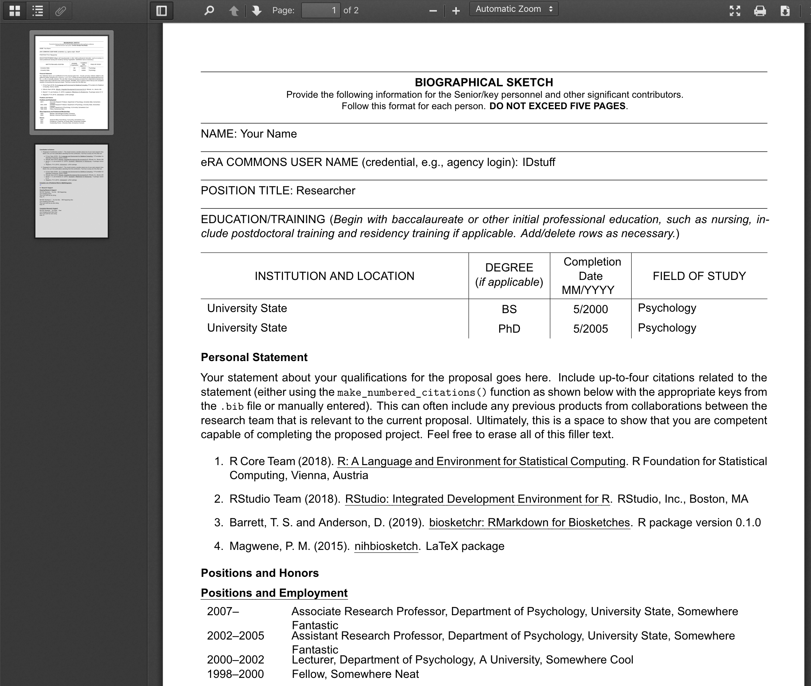

<!-- README.md is generated from README.Rmd. Please edit that file -->

```{r setup, include = FALSE}
knitr::opts_chunk$set(
  collapse = TRUE,
  comment = "#>",
  fig.path = "man/figures/README-",
  out.width = "100%"
)
devtools::load_all()
```

# `biosketchr` `v`r packageVersion("biosketchr")`` 

<!-- badges: start -->
[](https://www.tidyverse.org/lifecycle/#experimental)
[](https://travis-ci.com/TysonStanley/biosketchr)
<!-- badges: end -->


The goal of `biosketchr` is to make two aspects of creating a Biosketch better:

1. Formatting of the biosketch is automatically done for you
2. The citations are automatically formatted and inserted in the document

## Installation

You can install `biosketchr` with:

``` r
remotes::install_github("tysonstanley/biosketchr")
```

## LaTeX

The template was created by Paul M. Magwene and can be found at: [github.com/pmagwene/latex-nihbiosketch](https://github.com/pmagwene/latex-nihbiosketch).

## Example

To start, you'll want to select the appropriate template (currently only the NIH one) from the `biosketchr` package. This will create a folder with whatever name you choose that contains an `Rmd` file, the appropriate `.cls` file, and a `.bib` file.


The `.Rmd` file will open automatically showing you this template.


This is where you'll do all the editing, writing your statement, fill in education, etc. You'll also want to edit the `yourbibfile.bib` file with your citations that you want to include in the biosketch.

When you `knit` this, it will produce a PDF file in the same folder that is formatted like the appropriate biosketch. This PDF will look something like the following:



Enjoy biosketching with RMarkdown!


## Note

The package is still undergoing some development and we would love feedback on any aspect that doesn't work as expected. 

We also want to thank the [`rticles`](https://github.com/rstudio/rticles) package for showing how to create RMarkdown templates such as in `biosketchr`.

Please note that the 'biosketchr' project is released with a
[Contributor Code of Conduct](CODE_OF_CONDUCT.md).
By contributing to this project, you agree to abide by its terms.
