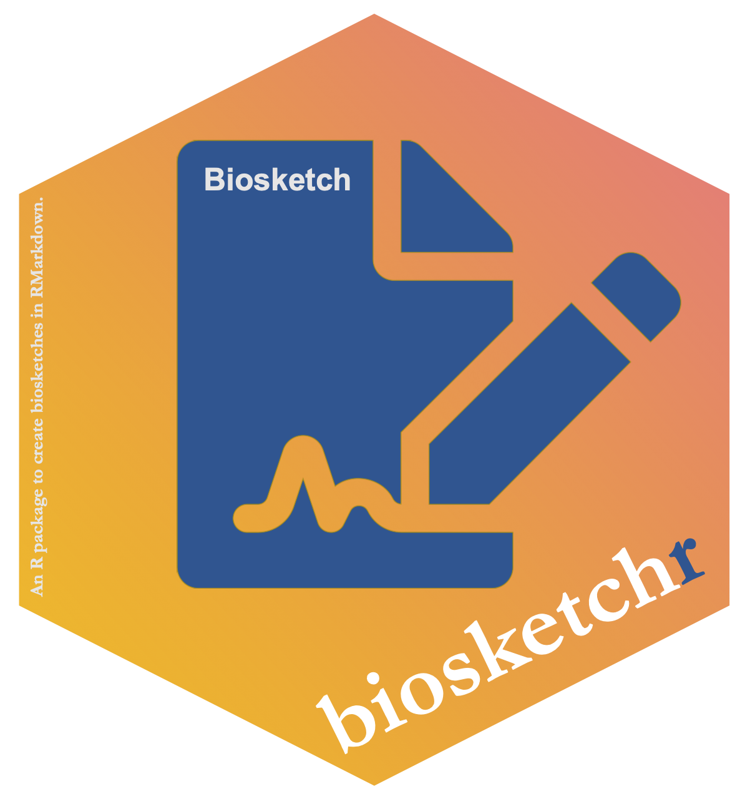

<!-- README.md is generated from README.Rmd. Please edit that file -->

# `biosketchr` `v0.1.2` 

The goal of `biosketchr` is to make two aspects of creating a Biosketch
better:

1.  Formatting of the biosketch is automatically done for you
2.  The citations are automatically formatted and inserted in the
    document

## Installation

You can install `biosketchr` with:

``` r
remotes::install_github("tysonstanley/biosketchr")
```

## LaTeX

The template was created by Paul M. Magwene and can be found at:
[github.com/pmagwene/latex-nihbiosketch](https://github.com/pmagwene/latex-nihbiosketch).

## Example

To start, you’ll want to select the appropriate template (currently only
the NIH one) from the `biosketchr` package. This will create a folder
with whatever name you choose that contains an `Rmd` file, the
appropriate `.cls` file, and a `.bib`
file.


The `.Rmd` file will open automatically showing you this
template.


This is where you’ll do all the editing, writing your statement, fill in
education, etc. You’ll also want to edit the `yourbibfile.bib` file with
your citations that you want to include in the biosketch.

When you `knit` this, it will produce a PDF file in the same folder that
is formatted like the appropriate biosketch. This PDF will look
something like the
following:


Yay\! Biosketching with RMarkdown\!

## Note

The package is still undergoing some development and we would love
feedback on any aspect that doesn’t work as expected.

We also want to thank the
[`rticles`](https://github.com/rstudio/rticles) package for showing how
to create RMarkdown templates such as in `biosketchr`.
